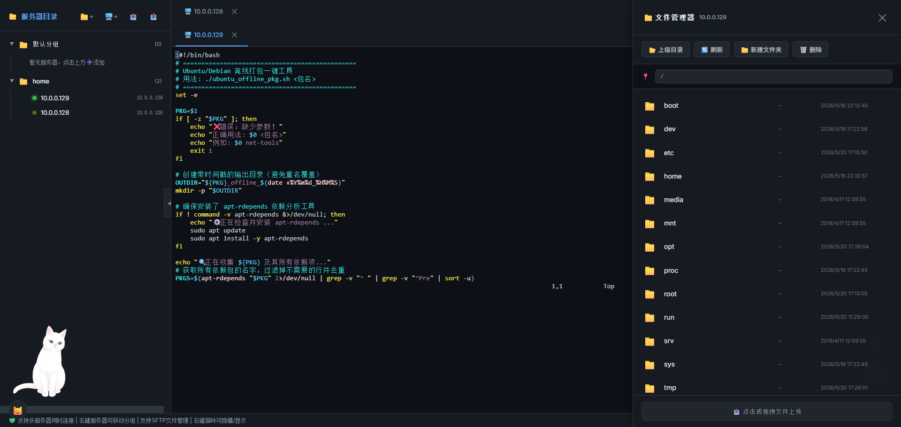

# 前言

● 依赖于node.js 本地部署的webssh项目:

● 环境：node-v24.15.0-x64.msi

● node.js下载地址：https://nodejs.org/dist/v24.15.0/node-v24.15.0-x64.msi

● 本项目最大有点轻量化 只有10M左右

● 整体UI效果




# 功能

● 服务器管理

● 支持新建目录 

● 连接信息保存为json格式

● 导入json配置 

● 导出json配置

● 新建连接

● ssh精灵

● 自定义背景颜色

● 侧边栏收纳 拉伸

● 网页版本私有部署

● 本地exe应用程序安装


# 安装方式：

安装完成node.js后

进入配置目录webssh目录下打开cmd

输入即可开始使用

```bash
# 安装依赖

npm install 

或

cnpm install 

# 启动程序

npm stop --if-present && npm start
```